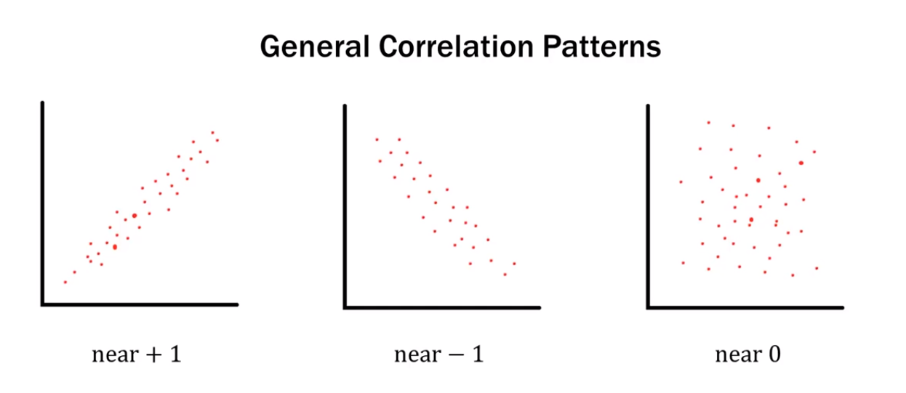
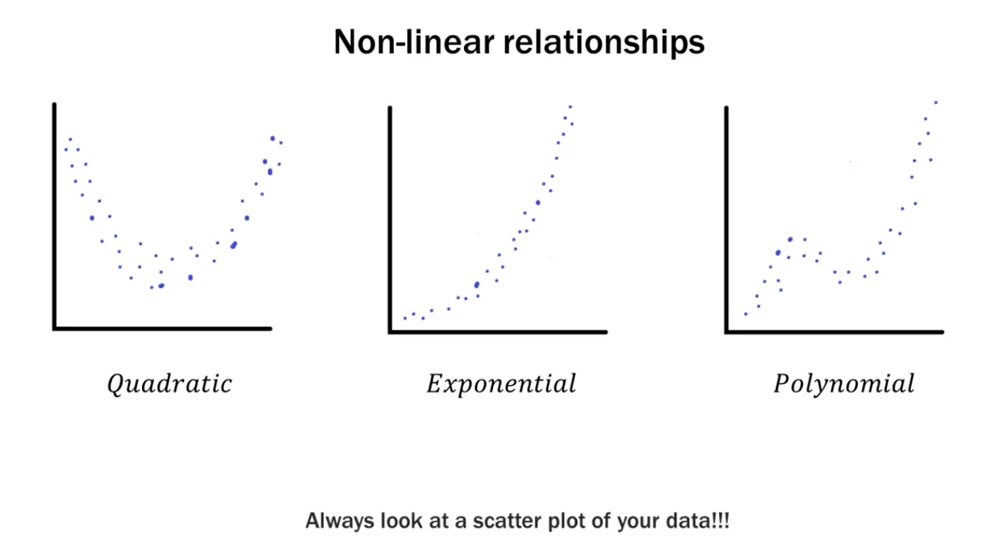
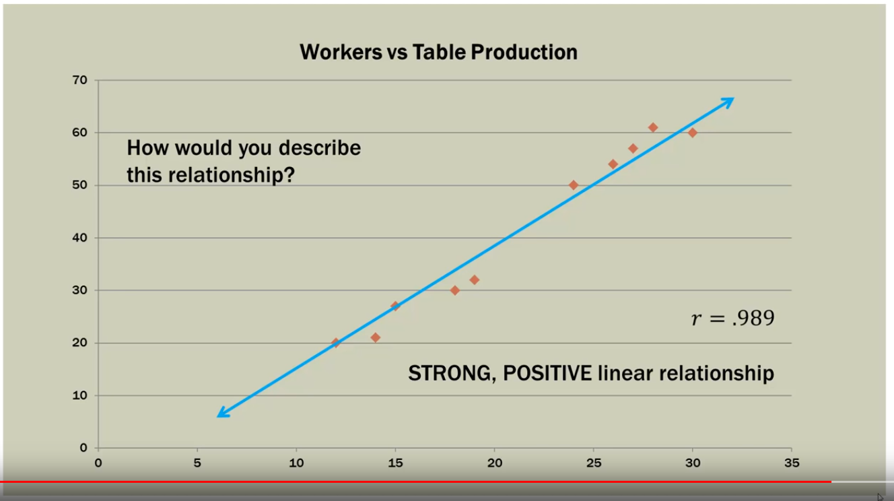

```{r setup, include=FALSE}
knitr::opts_chunk$set(echo = TRUE)
rm(list = ls())
```

## Introduction
* YouTube link: https://youtu.be/4EXNedimDMs

* Series Subject: Bivariate relationships

## Notes
* When analizying Bivariate relationships always use a scatterplot.

* Covariance provides the direction (positive, negative, near zero) of the linear relationship between two variables.
    + While **correlation** provides *direction* and *strength*.

* Covariance result has no upper or lower bound and its size is dependent on the scale of the variables.
    + While **correlation** is always between -1 and +1 and its scale is *independent* of the scale of the variables themselves.
    + Correlation allows us to compare variables that are measure in different ways, I.e. we can look at the correlation between temperature outside and energy usage in watts.

* Covariance is not standardized.
    + While **correlation** is standardized (think z-score).

### Correlation caveats
* Before going crazy computing correlations look at a scatterplot of the data. What pattern (if any) does it exhibit?

* Only applicable to linear relationships. There are many other types of relationships that can exist between two variables.

* Correlation is not Causation.
    + Spurius correlation: two completely unrelated factors that may have a mathematical correlation but have NO sensible correlation in real life.
    
* Corrrelation strength does not necessarily mean the correlation is statistically significant; related to sample size.

* General correlation patterns


* Example of Non-linear relationships


### Correlation Formula
* $r$ is called the (Pearson) correlation coefficient

$$r = \frac{Covariance(x,y)}{\textrm(Standard Deviation(x) * Standard Deviation(y))}$$
$$r=\frac{Cov(x,y)}{S_xS_y} $$

* Covariance between two variables.
* Divided by the product of their standard deviations.
* If you know $r$ and the standard deviations, you can find the covariance.

## Example
Rising Hills Manufacturing wishes to study the relationship between the number of workers, *x*, and number of tables produced, *y*, in its plant.
To do so, it obtained 10 samples, each one hour in length, from the production floor.

$$x = \textrm{number of workers}$$
$$y = \textrm{number of tables produced}$$

```{r}
x <- c(12, 30, 15, 24, 14, 18, 28, 26, 19, 27)
y <- c(20, 60, 27, 50, 21, 30, 61, 54, 32, 57)
x.mean <- mean(x)
x.sd <- round(sd(x),2)
x.sd

y.mean <- mean(y)
y.sd <- round(sd(y),2)
y.sd

```

Plotting *x* and *y* shows us this scatterplot
```{r}
plot(x,y)
```

* How would you describe this relationship?
* What correlation are you expecting?

In order to continue calculating the *correlation* we need to calculate the covariance.
```{r}
x.minus.xmean <- x - x.mean
x.minus.xmean
y.minus.ymean <- y - y.mean
y.minus.ymean
x.times.y <- x.minus.xmean * y.minus.ymean
x.times.y

sum.x.times.y <- sum(x.times.y)
sum.x.times.y

analysis.table <- cbind(x, y, x.minus.xmean, y.minus.ymean, x.times.y)
analysis.table
```

$$Cov(x,y) = S_{xy} = \frac{962.4}{n - 1}$$
$$\frac{962.4}{9}$$
$$Cov(x,y) = 106.93$$
```{r}
cov.x.y <- round(cov(x,y),2)
```

## Correlation calculation

-------------------------------|-------------------------------  
-------------------------------|-------------------------------
$r=\frac{Cov(x,y)}{S_xS_y}$    |$r=\frac{106.93}{108.15}$
$r=\frac{S_{xy}}{S_xS_y}$      |$r=.989$
$r=\frac{106.93}{6.48x16.69}$  |

```{r}
r <- round(cov.x.y / (x.sd * y.sd),3)
r
```



In R the correlation is calculated this way:
```{r}
round(cor(x,y),3)
```

## Relationship rule of thumb

How can we more objectively state whether or not a relationship exists between two variables?
$$\textrm{If } |r| \geq \frac{2}{\sqrt{n}} \textrm{ then a relationship exists} $$

For our problem: $\textrm{If } |r| \geq \frac{2}{\sqrt{10}} = 0.632 \textrm{ is the rule of thumb threshold}$


