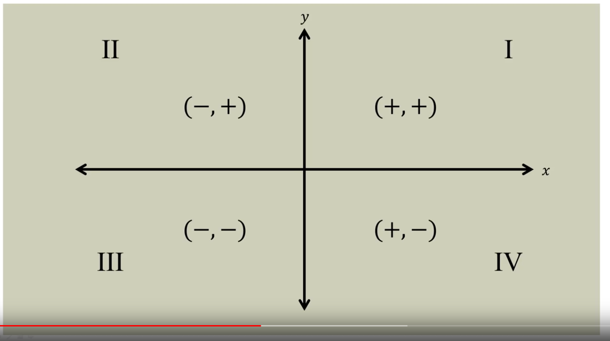
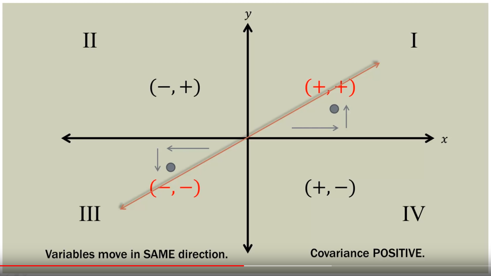
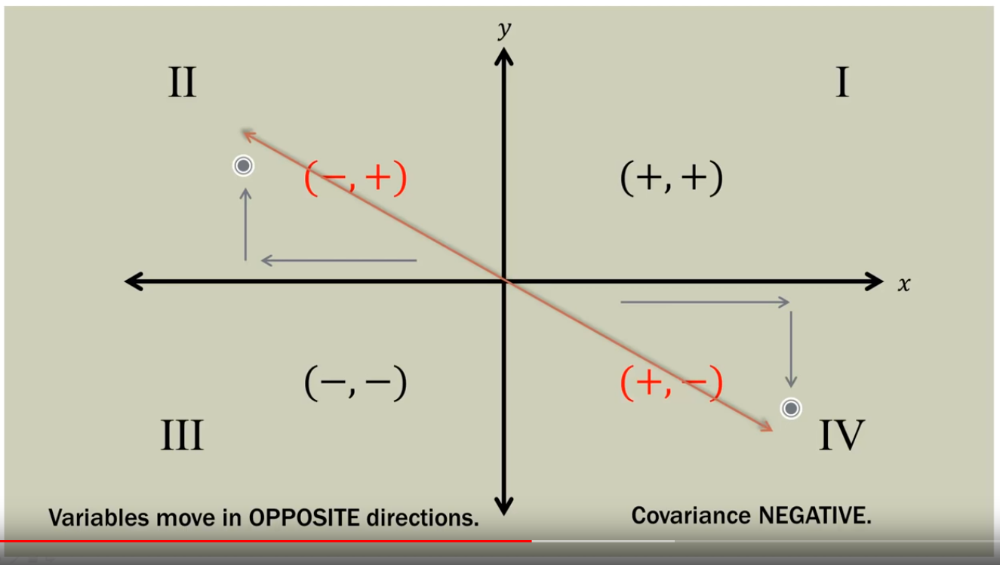
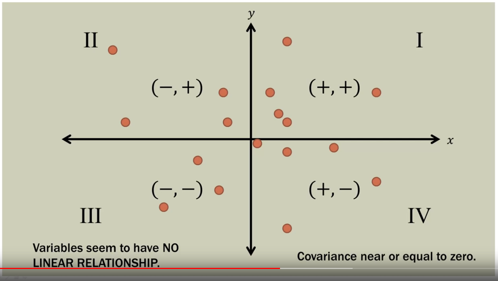
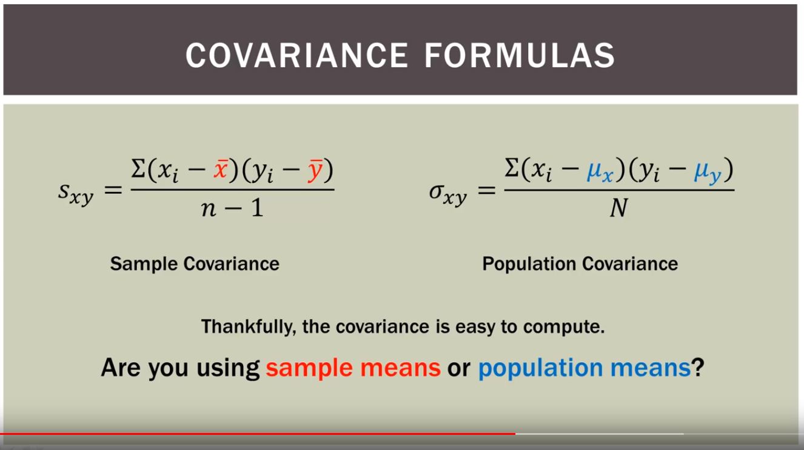

```{r setup, include=FALSE}
knitr::opts_chunk$set(echo = TRUE)
rm(list = ls())
```

## Introduction
* YouTube link: https://youtu.be/xGbpuFNR1ME

* Series Subject: Bivariate relationships


## Notes

* **Covariance**. Is a measure of how changes in one variable are associated with changes in a second variable. Specifically, **covariance** measures the degree to which two variables are linearly associated.
    + A positive value indicates a direct or increasing linear relationship.
    + A negative value indicates a decreasing relationship.
    + This is called *sign* or *direction* of the covariance
    

* **Covariance** is one of the family statiscal measures used to analyze the linear relationships between two variables.

* Both variables *co-vary* or *vary together*.

* Covariance provides the direction (positive, negative, near zero) of the linear relationship between two variables.

* How do two variables behave as a PAIR?

* Covariance, correlation and linear regression are closely related.


* Covariance is shown positive when *x* increases and *y* increases, hence we can say the slope is positive


* Covariance is shown negative when *x* decreases and *y* decreases, hence we can say the slope is negative


* When data points in quadrant are show as scatter, we can say the variables don't have a linear relationship, hence the covariance is near or equal to zero, because it doesn't exhibit any sort of pattern


* The covariance formulas defined help us to get the *sample means* or the *population means*, this depends on the problem we're trying to solve


* Sample covariance formula
    + $x_i$: Each data point for *x*
    + $\bar{x}$: Mean for all *x* data points

* Sample covariance formula explained:
    + In the first parenthesis we're taking each data point for *x* and then we substract the mean for *x*.
    + In the second parenthesis we're taking each data point for *y* and then we substract the mean for *y*.
    + After we do the substraction, we multiply these two figures together.
    + Summation $\sum$ sign tell us that after multiplying them together we sum the result.
    + After adding them up, we proceed to divide the result between the number of samples minus one $n-1$
    
## Example
Rising Hills Manufacturing wishes to study the relationship between the number of workers, *x*, and number of tables produced, *y*, in its plant.
To do so, it obtained 10 samples, each one hour in length, from the production floor.

$$x = \textrm{number of workers}$$
$$y = \textrm{number of tables produced}$$

```{r}
x <- c(12, 30, 15, 24, 14, 18, 28, 26, 19, 27)
y <- c(20, 60, 27, 50, 21, 30, 61, 54, 32, 57)
x.mean <- mean(x)
x.mean

y.mean <- mean(y)
y.mean

```

Plotting *x* and *y* show us this relationship
```{r}
plot(data.frame(x,y))
```

The plot help us to describe a *positive covariance* for our data points.

We proceed to calculate $(x_i - \bar{x})$ of our *sample covariance* formula:
```{r}
x.minus.xmean <- x - x.mean
x.minus.xmean
```

Then we calculate $(y_i - \bar{y})$ of our *sample covariance* formula:
```{r}
y.minus.ymean <- y - y.mean
y.minus.ymean
```

Finally, we calculate $(x_i - \bar{x}) (y_i - \bar{y})$
```{r}
x.times.y <- x.minus.xmean * y.minus.ymean
x.times.y

sum.x.times.y <- sum(x.times.y)
sum.x.times.y
```

Condensing the table for analysis
```{r}
analysis.table <- cbind(x, y, x.minus.xmean, y.minus.ymean, x.times.y)
analysis.table
```

$$Cov(x,y) = S_{xy} = \frac{962.4}{n - 1}$$
$$\frac{962.4}{9}$$
$$Cov(x,y) = 106.93$$

```{r}

plot(x, y,
       xlab = "Number of workers",
       ylab = "Number of tables")
abline( lm(y~x) )

```

In R we calculate the **covariance** this way
```{r}
round(cov(x,y),2)
```

## Conclusion
* We can determine there's a positive covariance between these two variables.


